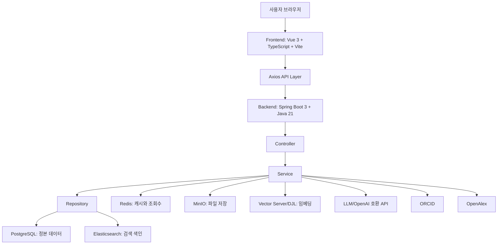
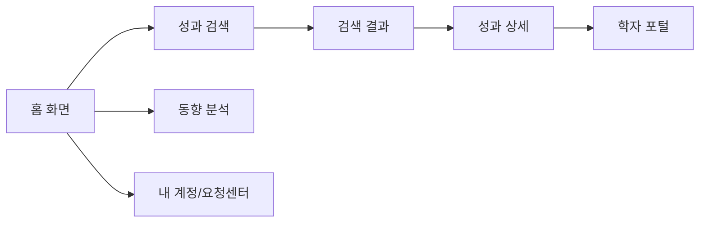
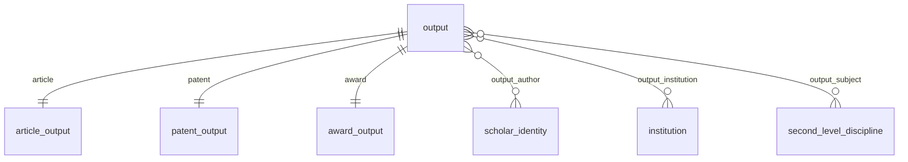
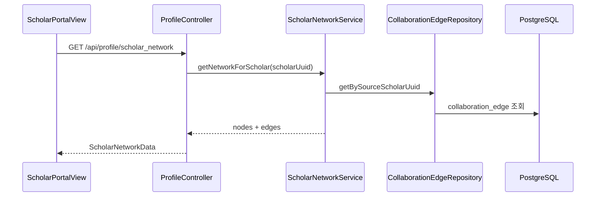
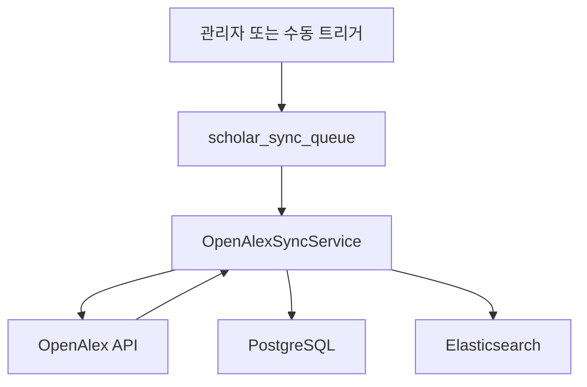
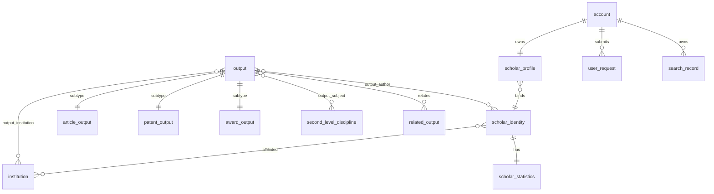
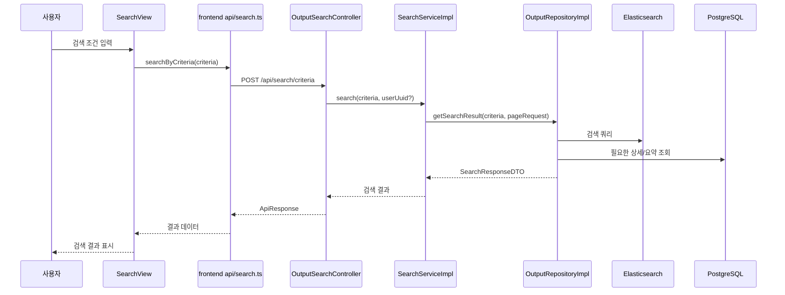
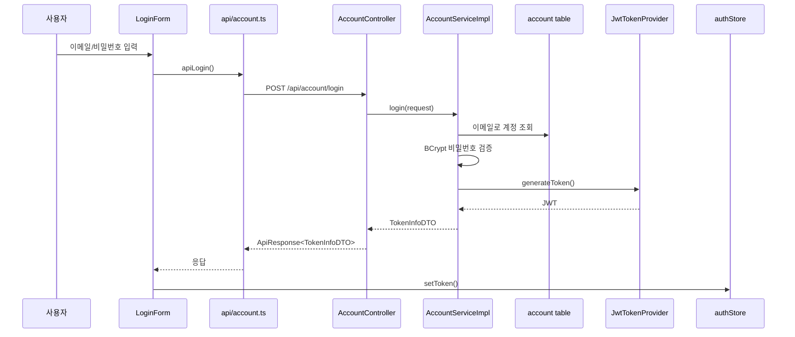
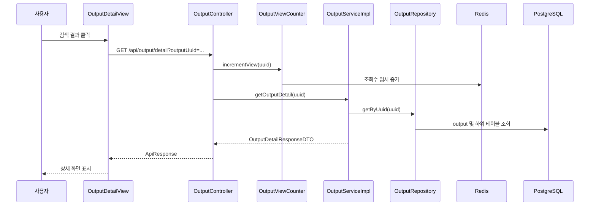

# 학술프로그램 상세 분석 및 실행 플랜

> 대상 프로젝트: 학술 성과 공유 플랫폼, Academic Results Sharing Platform  
> 작성 목적: 코드와 구조를 처음 보는 사람도 이 프로젝트가 무엇이고, 어떻게 동작하며, 어떤 순서로 설명하거나 개선할 수 있는지 이해할 수 있도록 정리한다.  
> 분석 방식: 메인 분석과 서브에이전트 병렬 분석을 결합했다. 백엔드, 프론트엔드, 데이터/인프라/문서 영역을 나누어 확인한 뒤 하나의 설명서로 통합했다.

---

## 전체 결론

이 프로젝트는 단순한 게시판이나 검색 페이지가 아니라, 논문, 특허, 수상, 연구자, 기관, 학문 분야, 검색 기록, 분석 결과, 외부 학술 데이터 동기화를 하나로 묶는 풀스택 학술 성과 플랫폼이다.  

사용자는 브라우저에서 Vue 기반 화면을 본다. 화면은 `/api/...` 형태의 요청을 Spring Boot 백엔드로 보낸다. 백엔드는 PostgreSQL, Elasticsearch, Redis, MinIO, Python 벡터 서버, OpenAlex, ORCID, LLM 서비스를 필요에 따라 호출한다.  

초보자에게 비유하면 다음과 같다.

- PostgreSQL은 원본 장부다. 학자, 기관, 성과, 요청, 분석 결과의 정식 기록을 보관한다.
- Elasticsearch는 검색용 색인이다. 도서관 책 제목, 키워드, 초록을 빠르게 찾기 위한 검색 카드함에 가깝다.
- Redis는 임시 메모장이다. 자주 쓰는 목록과 조회수를 잠깐 담아 빠르게 꺼낸다.
- MinIO는 파일 창고다. 아바타 같은 파일을 저장한다.
- 벡터 서버는 문장을 숫자 좌표로 바꾸는 번역기다. 문장 의미를 계산 가능한 형태로 만든다.
- LLM은 사용자의 자연어 검색 의도를 구조화된 검색 조건으로 바꾸는 해석 도우미다.
- Docker Compose는 여러 서비스를 한 번에 켜는 실행표다.

---

## 0-1. 서브에이전트 세분화 작업 결과

이번 분석은 다음처럼 분업했다.

| 담당 | 분석 범위 | 주요 산출 |
|---|---|---|
| 백엔드 분석 서브에이전트 | `backend/src/main/java`, 테스트, 설정, API 흐름 | 컨트롤러 11개, 서비스 58개, 저장소 46개, 모델 155개, 공통 36개, 태스크 5개, 설정 10개, 테스트 28개 기준 백엔드 구조 요약 |
| 프론트엔드 분석 서브에이전트 | `frontend/src`, 라우터, 뷰, 컴포넌트, 스토어, API | Vue 3, TypeScript, Vite, Pinia, Naive UI 기반 화면 구조와 사용자 흐름 정리 |
| 데이터/인프라 분석 서브에이전트 | `docs`, `RFC`, `docker-compose`, DB SQL, 벤치마크 | 프로젝트 배경, PostgreSQL/Elasticsearch 설계, Docker 인프라, 벤치마크 결과 정리 |
| 메인 통합 분석 | 전체 구조, 핵심 코드 직접 확인, 문서 작성 | 이 `학술프로그램.md` 파일 작성 |

---

## 0-2. 전체 시스템 한눈에 보기



---

# 백엔드 중심 포트폴리오 핵심 설명

## 1. 담당 영역과 핵심 기여

백엔드와 직접 맞닿는 구현 범위는 학술 성과 검색·상세, 연구자·기관 조회, 계정·ORCID 연결, 요청센터, 분석 API, 외부 데이터 동기화, 검색 인프라, 캐시와 객체 저장소 연동이다. 개인별 커밋 이력은 현재 작업 폴더에서 확인할 수 없으므로 “내가 모든 코드를 작성했다”고 단정하지 않고, 백엔드에서 중점적으로 설명할 구현 영역과 설계 판단을 구분한다.

- Spring Boot REST API의 Controller–Service–Repository 계층
- PostgreSQL 정본 데이터와 Elasticsearch 검색 조회 모델의 분리
- 필터·다국어 전문 검색·벡터 검색을 조합한 검색 API
- Redis TTL 캐시와 조회수 write-behind 집계
- MinIO 아바타 객체 저장
- JWT 인증, principal UUID 범위 검사, ORCID OAuth 연결
- OpenAlex 큐·비동기 동기화와 PostgreSQL–Elasticsearch 최종 일관성
- LLM 자연어 검색 파싱, 허용값 재검증, vector provider 폴백
- 단위 테스트·H2 저장소 테스트·벤치마크

| 계층 | 실제 책임 | 대표 근거 |
|---|---|---|
| Controller | HTTP 요청, DTO, 인증 주체, 응답 반환 | backend/src/main/java/net/saitewasreset/academicplatform/controller |
| Service | 검증, 업무 규칙, 트랜잭션, 외부 연동 조합 | backend/src/main/java/net/saitewasreset/academicplatform/service |
| Repository | JPA CRUD, JDBC 대량 처리, Elasticsearch 검색·색인 | backend/src/main/java/net/saitewasreset/academicplatform/repository |
| Model | Entity, DTO, 검색 문서, 요청·응답 계약 | backend/src/main/java/net/saitewasreset/academicplatform/model |
| Common/Config | 공통 응답·예외, JWT, Redis·ES·MinIO 설정 | backend/src/main/java/net/saitewasreset/academicplatform/common 및 config |
| Task/Async | 조회수, 인기 점수, 요약, 지표, OpenAlex 작업 | backend/src/main/java/net/saitewasreset/academicplatform/task 및 service/update |

## 2. 백엔드 아키텍처

Controller는 HTTP와 DTO를 담당하고 Service가 업무 흐름·트랜잭션·외부 연동을 조합한다. Repository는 데이터 성격에 따라 JPA, JDBC, Elasticsearch Client를 선택한다.

~~~mermaid
flowchart LR
    Browser[브라우저] --> Axios[Axios API 계층]
    Axios --> Filter[JWT Filter / SecurityContext]
    Filter --> Controller[Controller]
    Controller --> Service[Service]
    Service --> Repository[Repository]
    Repository --> PG[PostgreSQL 정본 데이터]
    Repository --> ES[Elasticsearch 검색 색인]
    Service --> Redis[Redis 캐시·조회수]
    Service --> MinIO[MinIO 아바타 객체]
    Service --> External[OpenAlex / ORCID / LLM / Vector]
    Task[Scheduler / Async Worker] --> PG
    Task --> ES
    Task --> Redis
~~~

단순 계정·프로필 CRUD는 관계와 검증을 함께 다뤄야 하므로 JPA가 읽기 쉽다. 조회수 일괄 반영과 요약 테이블 upsert는 JDBC와 PostgreSQL ON CONFLICT가 적합하다. 제목·초록·키워드와 임베딩을 조합하는 검색은 Elasticsearch Java Client가 적합하다. 기능별 저장 기술 선택으로 도메인 로직의 가독성, 검색 성능과 대량 처리 효율을 함께 얻는 대신 여러 저장소의 정합성을 애플리케이션이 관리해야 한다.

OutputRepositoryImpl은 검색 질의, 통계 집계, 조회수 반영과 요약 upsert가 모여 있는 핵심 저장소다. JPA Repository 목록만으로 시스템을 설명하면 실제 구현의 중심을 놓치게 된다.

근거: backend/src/main/java/net/saitewasreset/academicplatform/repository/output/impl/OutputRepositoryImpl.java, backend/src/main/java/net/saitewasreset/academicplatform/service/search/impl/SearchServiceImpl.java.

## 3. 요청 처리와 데이터 흐름

### 로그인과 후속 인증

1. LoginForm이 이메일과 비밀번호를 입력받는다.
2. frontend/src/api/account.ts가 account/login을 호출한다.
3. AccountController가 계정 조회와 BCrypt 검증을 Service에 위임한다.
4. JwtTokenProvider가 사용자 UUID·이름·이메일을 claims에 담아 토큰을 발급한다.
5. auth store가 토큰을 저장하고 Axios interceptor가 다음 요청에 Bearer 헤더를 붙인다.
6. JwtAuthFilter가 토큰을 검증하고 UserPrincipal을 SecurityContext에 넣는다.

~~~mermaid
sequenceDiagram
    participant U as 사용자
    participant F as LoginForm
    participant A as account API
    participant C as AccountController
    participant S as AccountService
    participant DB as PostgreSQL account
    participant J as JwtTokenProvider
    participant Store as authStore
    U->>F: 이메일·비밀번호 입력
    F->>A: apiLogin
    A->>C: POST account/login
    C->>S: login
    S->>DB: 계정 조회
    S->>S: BCrypt 검증
    S->>J: claims 생성
    J-->>S: JWT
    S-->>C: TokenInfoDTO
    C-->>A: ApiResponse
    A-->>F: 로그인 성공
    F->>Store: token 저장
~~~

근거: frontend/src/api/account.ts, frontend/src/stores/auth.ts, backend/src/main/java/net/saitewasreset/academicplatform/controller/account/AccountController.java, backend/src/main/java/net/saitewasreset/academicplatform/config/security/JwtAuthFilter.java, JwtTokenProvider.java.

### 조건 검색

화면 필터를 API DTO로 바꾼 뒤 Controller가 Service를 호출한다. 로그인 사용자의 검색 기록은 search_record에 저장하려고 시도하고, 질의가 있으면 vector provider가 임베딩을 만든다. Repository는 필터·다국어 전문 검색·벡터 또는 BM25를 조합해 Elasticsearch 결과를 DTO로 만든다.

~~~mermaid
sequenceDiagram
    participant V as SearchView
    participant A as search API
    participant C as OutputSearchController
    participant S as SearchService
    participant R as OutputRepositoryImpl
    participant H as Vector provider
    participant ES as Elasticsearch
    participant PG as PostgreSQL search_record
    V->>A: 화면 필터를 DTO로 변환
    A->>C: POST search/criteria
    C->>S: search(criteria, userUuid)
    opt 로그인 사용자
        S->>PG: 검색 이력 저장 시도
    end
    S->>R: 검색 조건 전달
    opt 임베딩 생성 가능
        R->>H: encode(query)
        H-->>R: embedding 또는 빈 벡터
    end
    R->>ES: filter + text/vector query
    ES-->>R: hits
    R-->>S: SearchResponseDTO
    S-->>C: 결과 또는 오류
    C-->>A: ApiResponse
    A-->>V: 목록·통계 표시
~~~

검색 이력 저장 예외를 catch하더라도 검색과 저장이 같은 Transactional 경계에 참여하면 rollback-only가 되어 commit 시 UnexpectedRollbackException이 날 수 있다. 검색 응답과 이력을 완전히 격리하려면 별도 트랜잭션 또는 commit 후 이벤트가 필요하다.

### 성과 상세와 조회수

성과 상세 Controller는 Service를 거쳐 Repository에서 논문·특허·수상 정보를 읽는다. 조회수는 Redis hash에 먼저 증가하고 OutputViewCountSyncTask가 주기적으로 DB에 반영한다.

~~~mermaid
sequenceDiagram
    participant U as 사용자
    participant C as OutputController
    participant V as OutputViewCounter
    participant S as OutputService
    participant R as OutputRepository
    participant Redis as Redis
    participant PG as PostgreSQL
    U->>C: GET output/detail
    C->>V: 조회수 증가
    V->>Redis: hash increment
    C->>S: getOutputDetail
    S->>R: 상세 조회
    R->>PG: output subtype 관계 조회
    PG-->>R: 상세 데이터
    R-->>S: DTO
    S-->>C: 상세 응답
    C-->>U: 화면 표시
    Note over Redis,PG: 1분 배치가 Redis 증가분을 DB에 반영
~~~

근거: backend/src/main/java/net/saitewasreset/academicplatform/controller/output/OutputController.java, service/output/impl/OutputServiceImpl.java, common/visitor/OutputViewCounter.java, task/OutputViewCountSyncTask.java.

### OpenAlex 동기화

OpenAlex 연동은 사용자 검색 응답과 백그라운드 수집을 분리한다. 학자 검색 결과를 큐에 넣고 응답한 뒤, 스케줄러 또는 manual-next worker가 큐를 선점한다. 특정 학자 직접 동기화는 큐의 SKIP LOCKED 흐름과 다를 수 있다.

~~~mermaid
sequenceDiagram
    participant API as Scholar API
    participant OA as OpenAlex
    participant Q as PostgreSQL Queue
    participant W as Scheduler / Sync Worker
    participant PG as PostgreSQL
    participant ES as Elasticsearch
    API->>OA: 학자 검색
    OA-->>API: 외부 학자 결과
    API->>Q: 동기화 작업 enqueue
    API-->>API: 사용자 검색 응답 반환
    W->>Q: scheduler 또는 manual-next로 작업 선점
    W->>OA: 학자·성과 상세 조회
    W->>PG: PostgreSQL 저장 단계 전체 TransactionTemplate
    W->>ES: 저장된 성과 색인
    W->>Q: 상태 갱신
~~~

근거: backend/src/main/java/net/saitewasreset/academicplatform/service/update/OpenAlexService.java, OpenAlexSyncService.java, config/update/AsyncConfig.java.

## 4. 저장 기술 선택

| 저장소/연동 | 정본 여부 | 주요 데이터 | 접근 패턴 | 선택 이유 | 일관성 | 장애 영향 |
|---|---|---|---|---|---|---|
| PostgreSQL | 정본 | 계정·학자·기관·성과·요청·분석 | JPA/JDBC/트랜잭션 | 관계·제약·upsert | 강한 관계형 정합성 | 핵심 API와 동기화 저장 실패 |
| Elasticsearch | 조회 모델 | 제목·초록·키워드·임베딩 색인 | Java Client, filter/multi-match/kNN | 전문·벡터 검색 | PostgreSQL과 최종 일관성 | 검색 누락 또는 빈 결과 |
| Redis | 임시/증분 | TTL 캐시·조회수·ORCID 상태 | Cache abstraction, hash, key-value | 지연시간과 write-behind | TTL·배치 반영에 의존 | stale cache·조회수 유실/중복 |
| MinIO | 파일 저장 | 아바타 객체 | UUID object key, byte[] GET | S3 호환 객체 저장 | DB 메타데이터와 분리 | orphan 파일·공개 접근 위험 |
| OpenAlex/ORCID | 외부 원천 | 학자·성과·식별 인증 | HTTP/WebClient/SDK | 외부 학술 데이터 확보 | 외부 응답·재처리 정책에 의존 | timeout·rate limit·부분 저장 |

## 5. JWT 인증과 인가 경계

JWT는 인증 수단이다. 토큰이 유효한지 확인하고 사용자의 UUID를 복원하는 것과, 그 사용자가 특정 변경 API를 실행할 권한이 있는지는 별개의 문제다. 현재 SecurityConfig는 anyRequest().permitAll()이고, 일부 계정·요청 API는 Controller의 requireUserUuid와 principal UUID 전달로 수동 범위를 제한한다. 중앙화된 RBAC나 일관된 소유권 정책은 도입되지 않았다.

| 구분 | 현재 구현 | 경계 |
|---|---|---|
| Authentication | JWT 발급·검증, SecurityContext, UserPrincipal | 토큰 존재만으로 업무 권한이 생기지는 않음 |
| 사용자 범위 제한 | 일부 Controller의 principal UUID 검사 | 새 API에서 검사를 누락할 수 있음 |
| RBAC | 권한 목록과 역할 모델이 사실상 없음 | 관리자·운영자 분리 미흡 |
| URL 정책 | 전체 permitAll 후 수동 검사 | update API 노출 가능성 |

개선은 공개 API만 allowlist로 열고 기본값을 authenticated로 바꾸는 것, 갱신 API에 운영자 role을 요구하는 것, 무토큰·일반 사용자·운영자 토큰의 401/403 행렬을 테스트하는 순서로 진행한다. 근거: backend/src/main/java/net/saitewasreset/academicplatform/config/security/SecurityConfig.java, controller/update/UpdateController.java, controller/debug/DebugController.java.

## 6. 다국어 하이브리드 검색

검색은 두 경로로 동작한다. 임베딩 경로에서 full_text_search의 다국어 multi_match는 filter context의 필수 통과 조건이다. 이 경로에서는 BM25 점수를 합산하지 않고 벡터 0.90, 제목 constant score 0.06, 키워드 constant score 0.04를 더한다. 임베딩이 없을 때만 일반 multi_match의 BM25 점수로 폴백한다.

질의 임베딩은 DJL/ONNX 또는 Python provider를 선택한다. base application.yml에는 djl이 있지만 기본 dev profile의 application-dev.yml과 Docker prod 환경은 python으로 덮어쓸 수 있으므로 실행 환경별 기본값을 구분해야 한다. Elasticsearch Client Bean 자체가 없으면 정상적인 빈 page 폴백이 아니라 애플리케이션 wiring 실패가 될 수 있다. 호출 중 ES 오류를 빈 결과로 바꾸는 경로와 Bean 미구성은 구분해야 한다.

검색마다 동기 vector HTTP 호출이 발생하고 kNN numCandidates가 최소 500이다. 실제 벤치마크는 동시 사용자 20명에서 평균 789.75ms, P95 2442.77ms, P99 5961.18ms, TPS 10.26을 기록했다. vector와 ES 중 어느 쪽이 더 큰지 확정하려면 StopWatch 단계 로그를 분리 집계해야 한다.

근거: backend/src/main/java/net/saitewasreset/academicplatform/repository/output/impl/OutputRepositoryImpl.java, service/vector/impl/PythonVectorEmbeddingService.java, backend/src/main/resources/application.yml, application-dev.yml, benchmark/benchmark_paper_summary.md.

## 7. Redis 캐시와 조회수 집계

CacheConfig는 search_criteria, subject_map, institution_list를 1일, 학자 추천과 검색 결과를 30분 TTL로 구성한다. sync=true는 같은 키의 동시 cache miss 계산을 직렬화해 stampede를 줄인다. 반면 추천 캐시 무효화가 주석 처리된 부분이 있어 갱신 후 stale 데이터가 남을 수 있다.

조회수는 Redis hash에 먼저 누적하고 OutputViewCountSyncTask가 1분 주기로 DB에 반영한다. task 기본값이 비활성일 수 있고 compose가 관련 플래그를 전달하지 않으면 Redis 증가분이 오래 남는다. Redis를 drain한 뒤 PostgreSQL commit이 실패하면 유실, commit 후 Redis 차감이 실패하면 중복 반영 가능성이 생긴다.

개선 설계는 Redis key 원자적 rename 또는 Lua drain, outbox와 batch id 기록, 실패 시 pending 값 복구와 retry_count·oldest age 모니터링이다. 현재 Controller가 IP 없는 overload를 호출하고 존재 확인보다 먼저 증가시킬 수 있으며, IP dedup key에 output UUID가 없는 점도 수정 대상이다.

근거: backend/src/main/java/net/saitewasreset/academicplatform/config/cache/CacheConfig.java, common/visitor/OutputViewCounter.java, task/OutputViewCountSyncTask.java, backend/docker-compose.yaml.

## 8. MinIO 파일 저장

현재 파일 저장은 범용 문서 저장소가 아니라 공개 아바타 저장 기능에 가깝다. 업로드는 2MB 이하 JPEG/PNG를 검증하고 UUID를 object key로 사용한다. 다운로드는 object 전체를 byte 배열로 읽어 응답한다.

| 구현됨 | 미구현 또는 제한적 |
|---|---|
| MIME·크기 검증 | DB 파일 메타데이터·소유권 모델 |
| UUID object key | 이전 아바타 삭제와 orphan 정리 |
| MinIO put/get | 업로드 실패 시 보상 삭제 |
| 공개 UUID 조회 | 대용량 streaming·접근 제어 |

근거: backend/src/main/java/net/saitewasreset/academicplatform/config/storage/Minio.java, service/storage/impl/StorageServiceImpl.java, controller/storage/ObjectStorageController.java.

## 9. 외부 서비스 연동

| 연동 | 목적 | 현재 방어 | 확인된 한계 |
|---|---|---|---|
| ORCID | OAuth code 교환·식별자 연결 | WAITING/SUCCESS/FAILED 상태, checksum | DB bind 전 SUCCESS, 상태 TTL 없음 |
| OpenAlex | 학자·성과 수집 | timeout, 큐, executor, 필수 필드 필터 | 공통 retry/backoff/circuit breaker/rate limiter 없음 |
| LLM | 자연어 검색 조건 | 구조화 응답·DB 허용값 재검증·일반 조건 폴백 | 통합 테스트 비활성, prompt 로그 마스킹 점검 필요 |
| Vector | 의미 검색 임베딩 | DJL/ONNX 또는 Python, 빈 벡터 BM25 폴백 | fallback 비율·검색 품질 지표 부족 |

OpenAlex는 최신 성과 중 필수 필드가 있는 논문을 PostgreSQL과 Elasticsearch에 적재한다. 색인 뒤 sleep은 OpenAlex rate limiter가 아니라 ES 문서 색인 흐름이다. OpenAlex 호출 자체에는 mailto User-Agent 외 명시적인 pacing이 확인되지 않는다. ORCID 응답 검증은 MissingNode를 고려해 hasNonNull로 바꾸고, DB bind 성공 후 SUCCESS를 기록해야 한다.

## 10. 비동기·배치 처리

| 작업 | 주기/실행기 | 상태 |
|---|---|---|
| 조회수 DB 반영 | 1분 scheduled | 플래그에 따라 비활성 가능 |
| 인기 점수 | 10분 | 구현, Redis·DB 값에 의존 |
| 검색 요약 MV | 10분 | 구현, 별도 갱신 필요 |
| 학자·기관 지표 | 10분 | 구현, 계산 비용 주의 |
| OpenAlex | 야간 2분·주간 30분, executor | 큐·비동기 구현 |
| JournalMetrics | 스케줄 골격 | 실질 로직 부족 |
| DataUpdatePlan | cron 검증·레코드 생성 | executor 미완성 |

OpenAlex syncExecutor는 core 2, max 4, queue 50이다. 다중 인스턴스 분산 락은 없어 같은 배치가 중복 실행될 수 있다. 운영 전 기능별 플래그를 명시하고 DB SKIP LOCKED 또는 분산 락과 작업 heartbeat를 추가해야 한다.

## 11. 트랜잭션과 데이터 정합성

OpenAlex의 TransactionTemplate은 기관·학자 생성, output/article, 분야, 저자·기관 관계, work/reference 등 PostgreSQL 저장 단계 전체를 묶는다. Elasticsearch 색인은 이 트랜잭션 밖에서 후속 처리되므로 두 저장소는 원자적 동시 커밋이 아니라 최종 일관성 관계다.

~~~mermaid
flowchart LR
    Start[OpenAlex 작업 선점] --> PGTx[PostgreSQL 저장 전체 TransactionTemplate]
    PGTx --> Commit[PG commit]
    Commit --> Index[Elasticsearch 색인]
    Index -->|성공| Done[검색 가능]
    Index -->|오류를 로그만 남김| FalseDone[queue가 COMPLETED가 될 수 있음]
    FalseDone --> Reconcile[개선: outbox·retry·DLQ·PG-ES reconciliation]
~~~

DB 내부는 외래 키·고유 제약·ON CONFLICT upsert로 정합성을 지킨다. Redis·MinIO·Elasticsearch는 PostgreSQL 트랜잭션에 참여하지 않는다. AccountServiceImpl.register처럼 계정과 기본 프로필 저장이 하나의 서비스 트랜잭션으로 묶이지 않은 경로도 있어 부분 저장을 점검해야 한다.

## 12. 예외 처리와 관측성

BusinessException, 검증 오류, 접근 거부는 GlobalExceptionHandler와 RequestResultHandler를 통해 공통 ApiResponse로 변환된다. 성공·실패를 HTTP status만으로 판단하지 않고 body code를 함께 확인하는 계약은 클라이언트 구현을 단순하게 하지만, 프록시와 모니터링이 HTTP 200만 보고 성공으로 판단할 위험이 있다. 처리되지 않은 런타임 예외는 Spring 기본 오류 형식으로 내려갈 수 있다.

검색·배치·LLM에는 StopWatch와 로그가 있고 backend/pom.xml에는 Actuator와 Prometheus registry 의존성이 있다. 사용자 정의 Micrometer metric, correlation ID, trace, dashboard와 alert 설정은 확인되지 않았다. 검색 오류를 빈 결과로 숨기는 경로에는 search fallback, ES error, vector latency 지표를 추가하는 것이 다음 단계다.

## 13. 테스트 전략

| 테스트 층 | 현재 검증 | 공백 |
|---|---|---|
| Mockito 서비스 테스트 | 계정·검색·요청·분석·계산 | 실제 인프라 계약 없음 |
| H2 JPA slice | 저장소와 관계 조회 | Flyway를 끄고 별도 schema 사용 |
| SpringBootTest | context와 일부 통합 | ES·Redis·MinIO·외부 API 미포함 |
| 조건부 PostgreSQL | JSONB 등 PostgreSQL 특성 | 환경 변수에 따라 실행 여부 변동 |
| LLM 통합 | 실제 호출 테스트 비활성 | timeout·구조화 응답 회귀 공백 |

기존 분석 기준 backend/src/test에서 약 28개 테스트 파일과 약 231개 Test 메서드가 있다. 후속 품질 게이트는 Testcontainers PostgreSQL·Redis·Elasticsearch, MinIO 통합, SecurityFilterChain 401/403, 외부 API timeout·429·500 장애 주입, API contract test, concurrency 1/5/10/20 성능 회귀다.

## 14. 프론트엔드와의 API 계약

프론트 흐름은 main.ts → App.vue → router/layout → view → component → store 또는 api → request.ts → backend다. request.ts는 /api base URL, 10초 timeout, Bearer 토큰, 공통 response envelope, 업무 오류 code, 401 logout을 담당한다.

화면과 DTO 사이에는 학문 분야 그룹화, article/patent/award 변환, UI 1-base와 Spring 0-base pagination, URL query·검색 이력 복원이 있다. Mock은 USE_MOCK 강제 모드와 VITE_ENABLE_MOCK_FALLBACK 실패 fallback이 공존한다. 값이 문자열 false가 아니면 fallback이 활성화되는 기본값은 운영에서 명시적으로 끄고 4xx·401·계약 오류는 mock 성공으로 바꾸지 않도록 분리해야 한다.

근거: frontend/src/api/request.ts, frontend/src/api/search.ts, frontend/src/api/output.ts, frontend/src/views/search/SearchView.vue.

## 15. 대표 트러블슈팅

각 사례는 상태, 증상, 원인, 진단 근거, 해결·완화, 재발 방지, 검증 지표 순서로 기록한다.

### 검색 API 동시성 병목 — 실제 관측

동시 사용자 20명에서 평균 789.75ms, P95 2442.77ms, P99 5961.18ms, TPS 10.26이었다. 동기 vector 호출과 kNN 후보 500을 원인 후보로 분리하고, embedding cache·동시 요청 병합·batching·후보 수 튜닝·단계별 latency 계측으로 개선한다. 같은 부하에서 P95와 recall@k를 함께 검증한다. 근거: benchmark/benchmark_paper_summary.md, benchmark_results.json.

### 로그인·학자 route 불일치 — 코드에서 확인

실제 로그인 화면은 auth/login인데 guard와 오류 처리 일부가 account/login으로 이동한다. scholar-profile과 scholar-portal route name도 혼용된다. route 상수화와 route contract test를 적용하고 404 비율 0을 검증한다. 근거: frontend/src/router/index.ts, frontend/src/router/guards/permission.ts, frontend/src/api/request.ts, frontend/src/views/scholar/SearchResultsView.vue.

### 정정 요청 endpoint·pagination 불일치 — 코드에서 확인

프론트 정정 요청 경로와 AccountController mapping이 다르고, 프론트 pageSize와 Spring Pageable의 size가 다르다. RFC와 endpoint를 통일하고 OpenAPI client generation 또는 Controller contract test를 추가한다. 검증은 정정 요청 2xx, DB 저장, 페이지 크기 일치다. 근거: frontend/src/api/requestCenter.ts, backend/src/main/java/net/saitewasreset/academicplatform/controller/account/AccountController.java, RFC/RFC4.md.

### permitAll과 갱신 API 노출 — 코드에서 확인된 보안 위험

SecurityConfig의 anyRequest permitAll과 UpdateController의 수동 인증 부재가 결합되면 인증 없이 OpenAlex 동기화를 실행할 수 있다. 기본 authenticated 정책, 공개 endpoint allowlist, update 운영자 role, 무토큰·일반 사용자·운영자 401/403 행렬을 적용한다.

### Mock fallback이 장애를 성공처럼 보임 — 코드에서 확인

VITE_ENABLE_MOCK_FALLBACK이 false가 아니면 404·401·500·timeout이 데모 데이터로 표시될 수 있다. production opt-in으로 바꾸고 운영 isMockData 응답 0건을 검증한다. 근거: frontend/src/api/search.ts, frontend/src/api/output.ts.

### Redis 조회수의 중복·유실 — 코드에서 확인

Controller가 IP 없는 overload를 호출하고 존재 확인보다 먼저 Redis를 증가시킬 수 있다. IP dedup key에 output UUID가 없으며, drain 뒤 PG commit 실패 시 유실 창이 있다. output UUID와 viewer fingerprint를 함께 key로 쓰고 원자 drain·outbox·실패 주입 테스트를 적용한다.

### OpenAlex PG–ES 거짓 완료 — 코드에서 확인된 부분 실패

PostgreSQL 저장과 ES 색인이 분리되고 색인 오류가 로그만 남긴 채 queue를 COMPLETED로 만들 수 있다. INDEX_PENDING outbox, retry_count/next_retry_at, DLQ, PG–ES UUID reconciliation으로 보완하고 거짓 완료 0건과 검색 누락률을 검증한다.

### ORCID 상태 순서 — 코드에서 확인

Redis SUCCESS가 DB bind보다 먼저 기록될 수 있고 상태 key TTL이 없다. hasNonNull 검증, DB bind 성공 후 SUCCESS, 모든 실패 경로 FAILED, 상태 TTL과 실패 케이스 테스트를 추가한다.

### Flyway·H2·설계 SQL drift — 잠재 리스크

운영 Flyway와 테스트 H2 schema가 달라 H2 통과 후 PostgreSQL validate에서 기동 실패할 가능성이 있다. V1 불변·후속 migration, Testcontainers migrate, Flyway validate와 schema diff를 CI에 추가한다. 신규 운영 장애로 확인된 것이 아니라 검증 구조에서 발견한 잠재 리스크다.

## 16. 구현 상태와 개선 우선순위

| 영역 | 상태 | 다음 검증·개선 |
|---|---|---|
| JWT 발급·검증 | 구현 | 만료·secret fail-fast |
| 역할 기반 인가 | 미구현 | authenticated 기본값과 운영자 role |
| 하이브리드 검색·BM25 폴백 | 구현 | 단계별 latency·recall 회귀 |
| 검색 오류 명시 응답 | 미흡 | 빈 결과와 장애 응답 분리 |
| Redis TTL 캐시 | 구현 | invalidation 정책 |
| 조회수 write-behind | 구현 | 원자 drain·재처리 |
| MinIO 아바타 | 구현 | 소유권·삭제·streaming |
| OpenAlex 큐·비동기 | 구현 | retry·DLQ·reconciliation |
| DB–ES 보상 | 미구현 | outbox와 UUID 차집합 |
| DataUpdatePlan 실행기 | 미구현 | 실제 task executor |
| JournalMetrics | 골격 | 지표 계산 |
| Actuator/Prometheus | 의존성 포함 | custom metric·알람 |
| 실제 인프라 통합 테스트 | 제한적 | Testcontainers·failure injection |

우선순위는 보안 보호 경계, 프론트–백엔드 계약 불일치, 검색 단계별 프로파일링, 조회수 정합성, OpenAlex outbox/retry, 외부 연동 회복성, 통합 테스트, 관측성 순서다. 지표는 401/403, 404, 검색 P95, PG–ES UUID 차집합, retry 성공률, 운영 mock 응답 0건으로 잡는다.

## 17. 면접용 핵심 답변

### PostgreSQL과 Elasticsearch를 함께 사용한 이유

PostgreSQL은 관계·제약을 보장하는 정본이고 Elasticsearch는 다국어 전문 검색과 임베딩 kNN을 위한 조회 모델이다. 책임을 분리해 저장 정합성과 검색 성능을 함께 얻었다. 대신 두 저장소는 최종 일관성이므로 outbox와 reconciliation이 필요하다.

### 검색 장애 시 폴백

임베딩 provider가 빈 벡터를 반환하면 BM25 전문 검색으로 내려간다. ES Client Bean 자체가 없으면 빈 목록 폴백이 아니라 애플리케이션 기동 실패가 될 수 있으므로 두 상황을 구분한다. fallback 비율과 검색 품질을 함께 측정한다.

### Redis write-behind 이유

상세 조회마다 PostgreSQL을 갱신하면 쓰기 경합이 늘어난다. Redis에 증가분을 모아 1분 배치로 반영하면 읽기 경로를 가볍게 유지할 수 있다. 대신 drain과 commit 사이 유실·중복 창을 원자 drain, outbox와 재처리로 관리해야 한다.

### PostgreSQL–Elasticsearch 정합성 개선

DB commit과 함께 outbox 이벤트를 기록하고 별도 worker가 INDEX_PENDING을 재시도한다. 성공한 경우만 완료 처리하고 실패는 retry와 DLQ로 격리한다. 주기적으로 PostgreSQL UUID와 ES document ID 차집합을 검사한다.

### 검색 성능 진단

공개 조회와 조건 검색을 같은 부하에서 비교해 병목을 좁혔다. concurrency 20에서 P95 2442.77ms와 P99 5961.18ms를 확인했고 vector 호출과 kNN 후보를 원인 후보로 분리했다. 다음은 vector·ES·DTO 조립 시간을 분리하고 캐시·batching·후보 수를 recall과 함께 검증하는 것이다.

### 먼저 고칠 보안 문제

permitAll 기본값 때문에 Controller 검사 누락이 보호 누락으로 이어질 수 있다. 기본 authenticated와 공개 allowlist를 적용하고 update API에 운영자 role을 부여한다. 무토큰·일반 사용자·운영자 요청의 401/403을 자동화한다.

### 테스트 공백

단위 테스트와 H2 테스트는 있지만 ES·Redis·MinIO·SecurityFilterChain·외부 API 통합은 제한적이다. Testcontainers, API contract test, timeout·429·500 장애 주입, 검색 성능 회귀를 추가한다. H2와 Flyway drift는 PostgreSQL migrate 후 context 테스트로 보완한다.

---

# 1부터 100까지 상세 분석과 플랜

## 1. 이 프로젝트의 한 줄 정의

이 프로젝트는 학술 성과를 수집, 검색, 전시, 분석하는 풀스택 웹 플랫폼이다.  
일반 사용자는 성과를 검색하고, 연구자는 자신의 프로필과 성과를 관리하며, 관리자나 연구 의사결정자는 분야별 동향과 기관 순위를 볼 수 있다.

근거 파일:

- `README.md`
- `docs/学术成果分享平台-背景陈述-Public.md`
- `backend/pom.xml`
- `frontend/package.json`

## 2. 왜 필요한가

학술 성과는 논문, 특허, 수상, 프로젝트처럼 여러 형태로 흩어져 있다. 연구자 이름도 중복될 수 있고, 기관명도 여러 언어와 표기법으로 나뉜다. 이 플랫폼은 흩어진 성과를 모으고, 검색하고, 연구자와 기관 단위로 분석하기 위한 시스템이다.

문외한 관점에서는 “학술 정보를 위한 검색 포털 + 연구자 개인 페이지 + 데이터 분석 대시보드”라고 이해하면 된다.

## 3. 주요 사용자는 누구인가

주요 사용자는 세 부류다.

- 일반 사용자: 논문, 특허, 수상 성과를 검색하고 상세 정보를 확인한다.
- 연구자: 로그인하고 ORCID로 신원을 연결한 뒤 자신의 프로필과 성과를 관리한다.
- 연구 관리자: 분야별 핫스팟, 기관 랭킹, 연구 동향을 확인한다.

이 세 사용자가 같은 데이터베이스를 바라보지만, 각자 사용하는 화면과 기능은 다르다.

## 4. 프로젝트 규모

정적 분석 기준으로 확인한 규모는 다음과 같다.

| 영역 | 파일 수 |
|---|---:|
| 백엔드 Java 소스 | 322개 |
| 백엔드 테스트 | 28개 |
| 프론트엔드 `src` 파일 | 123개 |
| 프론트엔드 화면 파일 | 20개 |
| 프론트엔드 컴포넌트 | 49개 |
| 백엔드 엔티티 모델 | 61개 |

작은 과제용 예제라기보다, 도메인 모델과 인프라가 꽤 넓게 잡힌 프로젝트다.

## 5. 최상위 폴더 구조

루트 폴더는 다음처럼 구성된다.

| 폴더/파일 | 역할 |
|---|---|
| `backend` | Spring Boot 백엔드, DB 마이그레이션, Docker 설정, 벡터 서버 |
| `frontend` | Vue 3 프론트엔드 SPA |
| `docs` | 요구 조사, 요구 명세, 분석 모델, 아키텍처 설계, 데이터 설계 문서 |
| `RFC` | API, DB, 분석 산식, 개발 규칙 등 설계 논의 문서 |
| `benchmark` | 성능 측정 스크립트와 결과 |
| `scripts` | 로컬 실행용 PowerShell 스크립트 |
| `README.md` | 프로젝트 소개와 빠른 시작 |
| `benchmark_results.json` | 최신 벤치마크 결과 |

## 6. 프로젝트를 이해하는 추천 순서

처음 보는 사람은 코드부터 읽기보다 다음 순서로 보는 것이 좋다.

1. `README.md`로 전체 목적을 본다.
2. `docs/学术成果分享平台-背景陈述-Public.md`로 문제 배경을 본다.
3. `RFC/RFC4.md`로 API 약속을 본다.
4. `backend/src/main/resources/db/migration/V1__Initial_schema.sql`로 데이터 모델을 본다.
5. `frontend/src/router/index.ts`로 화면 구조를 본다.
6. `backend/src/main/java/.../controller`로 API 진입점을 본다.
7. `backend/src/main/java/.../service`로 실제 업무 흐름을 본다.

이 순서가 좋은 이유는 “무엇을 만들었는지”를 먼저 이해한 다음 “어떻게 만들었는지”로 들어가기 때문이다.

## 7. 기술 스택 전체

| 구분 | 기술 |
|---|---|
| 프론트엔드 | Vue 3, TypeScript, Vite |
| 상태 관리 | Pinia |
| 라우팅 | Vue Router |
| UI | Naive UI, 일부 `@vicons/ionicons5` |
| 차트 | ECharts, vue-echarts |
| HTTP | Axios |
| 백엔드 | Spring Boot 3.5.9, Java 21 |
| 보안 | Spring Security, JWT |
| DB | PostgreSQL 18 |
| ORM/마이그레이션 | Spring Data JPA, Flyway |
| 검색 | Elasticsearch 9.2.1, analysis-ik |
| 캐시 | Redis |
| 파일 저장 | MinIO |
| AI/LLM | OpenAI Java SDK, OpenAI 호환 API |
| 벡터 | DJL/ONNX Runtime 또는 Python sentence-transformers 서버 |
| 배포/실행 | Docker Compose |
| 테스트 | JUnit/Spring Boot Test, H2 테스트 스키마 |

## 8. 프론트엔드의 역할

프론트엔드는 사용자가 직접 보는 화면이다. 사용자가 검색어를 입력하거나 버튼을 누르면, 프론트엔드는 그 행동을 API 요청으로 바꾼다.  

프론트엔드는 데이터베이스에 직접 접근하지 않는다. 항상 백엔드 API를 통해 데이터를 받는다.

대표 파일:

- `frontend/src/main.ts`
- `frontend/src/App.vue`
- `frontend/src/router/index.ts`
- `frontend/src/api/request.ts`

## 9. 백엔드의 역할

백엔드는 플랫폼의 두뇌에 가깝다. 프론트엔드에서 들어온 요청을 받고, 사용자가 로그인했는지 확인하고, 데이터를 검증하고, DB나 외부 서비스를 호출한 뒤 결과를 다시 프론트엔드에 돌려준다.

백엔드는 다음 계층으로 나뉜다.

- Controller: HTTP 요청을 받는 문
- Service: 실제 업무 규칙을 처리하는 사람
- Repository: DB나 검색엔진에서 데이터를 꺼내오는 사람
- Model/DTO: 데이터를 표현하는 그릇
- Config/Common: 공통 설정과 예외 처리
- Task: 주기적으로 도는 배치 작업

## 10. 데이터 저장소의 역할 분담

이 프로젝트는 저장소를 하나만 쓰지 않는다. 이유는 데이터마다 잘하는 저장 방식이 다르기 때문이다.

| 저장소 | 담당 |
|---|---|
| PostgreSQL | 정식 데이터, 관계, 트랜잭션 |
| Elasticsearch | 검색, 다국어 전문 검색, 벡터 유사도 검색 |
| Redis | 캐시, 조회수 임시 저장 |
| MinIO | 이미지나 파일 |
| 벡터 서버 | 텍스트를 벡터로 변환 |

## 11. 루트 README가 말하는 핵심 기능

`README.md`는 이 플랫폼의 핵심 기능을 다음처럼 설명한다.

- 학술 성과 검색 및 필터링
- 연구자 프로필 및 성과 상세 전시
- 인기 성과 및 기관 순위 분석
- 표준화된 API 체계
- Redis, MinIO 기반 고성능 인프라
- 벡터 임베딩과 AI 서비스 통합

즉 “검색 사이트”만이 아니라 “학술 데이터 서비스 플랫폼”이다.

## 12. 배경 문서가 말하는 문제 정의

`docs/学术成果分享平台-背景陈述-Public.md`는 문제를 네 가지로 정리한다.

- 학술 성과가 흩어져 있어 자동 수집과 정제가 필요하다.
- 연구자 개인 학술 포털이 필요하다.
- 복잡한 검색 문법 대신 자연어 기반 지능형 검색이 필요하다.
- 분야 핫스팟, 협업 네트워크, 기관 역량 분석이 필요하다.

이 문서는 프로젝트의 “왜 만들었는가”에 해당한다.

## 13. docs 폴더의 의미

`docs` 폴더는 구현 코드가 아니라 산출물이다. 요구 조사, 요구 모델, 분석 모델, 아키텍처 설계, 데이터 설계가 단계별로 들어 있다.

| 폴더 | 의미 |
|---|---|
| `01.需求调研` | 요구 조사 |
| `02.需求建模` | 요구 모델링 |
| `03.分析模型` | 객체지향 분석 모델 |
| `04.架构设计` | 아키텍처 설계 |
| `05.数据设计` | 데이터 설계 |

포트폴리오에서는 “코드만 짠 것이 아니라 요구 분석부터 설계까지 수행했다”는 근거로 쓸 수 있다.

## 14. RFC 폴더의 의미

RFC는 Request For Comments의 약자다. 쉽게 말해 “우리 팀이 이런 방식으로 만들자고 합의한 설계 문서”다.

| 파일 | 역할 |
|---|---|
| `RFC1.md` | 개발 규칙, 커밋 규칙, 브랜치 전략, 품질 기준 |
| `RFC3.md` | 분야 열도와 연구 동향 분석 산식 |
| `RFC4.md` | API 문서 |
| `RFC5.md` | DB 설계와 검색 보조 스키마 |

## 15. RFC4의 중요성

`RFC/RFC4.md`는 프론트엔드와 백엔드가 서로 어떤 형식으로 대화할지 정한 문서다.  

모든 API 응답은 기본적으로 다음 구조를 따른다.

```ts
interface APIResponse<T> {
  code: number
  message: string
  data: T
}
```

초보자에게는 택배 상자로 비유할 수 있다. `code`는 배송 성공 여부, `message`는 안내문, `data`는 실제 물건이다.

## 16. 실제 백엔드 응답 래핑

백엔드에서는 `ApiResponse<T>`와 `RequestResultHandler`가 이 공통 응답 형식을 만든다.

근거 파일:

- `backend/src/main/java/net/saitewasreset/academicplatform/common/api/ApiResponse.java`
- `backend/src/main/java/net/saitewasreset/academicplatform/common/advice/RequestResultHandler.java`
- `backend/src/main/java/net/saitewasreset/academicplatform/common/exception/GlobalExceptionHandler.java`

대부분의 정상 응답은 `{ code: 200, message: "For Super Earth!", data: ... }` 형태로 감싸진다.

## 17. 프론트엔드 공통 API 처리

프론트엔드의 `frontend/src/api/request.ts`는 Axios 공통 클라이언트다.

이 파일은 다음을 담당한다.

- API 기본 주소를 `/api`로 둔다.
- 요청마다 JWT 토큰이 있으면 `Authorization: Bearer ...` 헤더를 붙인다.
- 전역 로딩 상태를 시작하고 끝낸다.
- 응답의 `code`를 보고 성공/실패를 판단한다.
- 401이 오면 로그아웃 처리와 로그인 페이지 이동을 수행한다.

## 18. 주의할 라우팅 불일치

분석 중 눈에 띈 불일치가 있다.

현재 라우터의 로그인 경로는 `/auth/login`이다. 하지만 일부 코드에서는 `/account/login`으로 이동시키고 있다.

관련 파일:

- `frontend/src/router/index.ts`
- `frontend/src/router/guards/permission.ts`
- `frontend/src/api/request.ts`

개선 플랜에서는 이 경로를 `/auth/login`으로 통일해야 한다.

## 19. 또 하나의 프론트 라우팅 불일치

서브에이전트 분석 결과, `SearchResultsView`에서 ORCID 단일 결과 이동 시 사용하는 route name이 `scholar-profile`로 보이지만, 실제 라우터에는 `scholar-portal`이 등록되어 있다.

이는 학자 검색 결과에서 특정 이동이 실패할 가능성이 있는 부분이다.  
개선 시 라우트 name을 실제 등록명과 맞추는 것이 좋다.

## 20. 전체 사용자 흐름

사용자 입장에서 대표 흐름은 다음과 같다.



검색 중심의 서비스지만, 성과 상세와 학자 포털, 기관 분석으로 계속 연결되는 구조다.

## 21. 프론트엔드 시작점

프론트엔드는 `frontend/src/main.ts`에서 시작된다.

이 파일은 다음 일을 한다.

- Vue 앱 생성
- Pinia 등록
- Router 등록
- Naive UI 등록
- ECharts 컴포넌트 전역 등록
- 앱을 `#app`에 mount
- heartbeat API를 호출해 백엔드 연결 상태 확인
- 30초마다 heartbeat 반복 확인

즉, 앱을 켜고 생명 신호를 확인하는 파일이다.

## 22. App.vue의 역할

`frontend/src/App.vue`는 전체 앱의 껍데기다.  

주로 다음을 담당한다.

- Naive UI 설정
- 테마 설정
- 중국어 locale 설정
- 라우터 화면 표시
- 사전 데이터 초기화

실제 페이지 내용은 대부분 `views`와 `components`에 있다.

## 23. 라우터 구조

라우터는 `frontend/src/router/index.ts`에 있다.

크게 세 레이아웃으로 나뉜다.

- `AuthLayout`: 로그인/회원가입
- `DefaultLayout`: 홈, 검색, 상세, 분석, 공지 등 일반 화면
- `AccountLayout`: 로그인 사용자의 프로필, ORCID, 요청센터

이 구조 덕분에 계정 화면과 일반 화면을 다르게 배치할 수 있다.

## 24. 주요 URL 목록

| URL | 화면 |
|---|---|
| `/` | 홈 |
| `/auth/login` | 로그인 |
| `/auth/register` | 회원가입 |
| `/search` | 성과 검색 |
| `/ai-search-test` | AI 검색 |
| `/output/:outputUuid` | 성과 상세 |
| `/scholar` | 학자 발견 |
| `/scholar/search` | 학자 검색 결과 |
| `/scholar/:scholarUuid` | 학자 포털 |
| `/trend` | 동향 분석 |
| `/institution/:uuid` | 기관 상세 |
| `/announcement` | 공지 목록 |
| `/announcement/:uuid` | 공지 상세 |
| `/account/profile` | 내 프로필 |
| `/account/bind` | ORCID 연결 |
| `/account/request` | 요청센터 |

## 25. 로그인 상태 관리

로그인 상태는 `frontend/src/stores/auth.ts`에서 관리한다.

저장하는 정보는 다음과 같다.

- `token`
- `expires`
- `name`
- `email`

이 정보는 `localStorage.auth`에 저장된다. 브라우저를 새로고침해도 로그인 상태가 남는 이유다.

주의점: 현재 `isLoggedIn`은 토큰 존재 여부만 보고, 만료 시간 `expires`를 직접 검증하지 않는다.

## 26. 프론트엔드 보호 라우트

`frontend/src/router/guards/permission.ts`는 페이지 이동 전에 로그인 여부를 검사한다.

예를 들어 `/account/profile`은 `meta: { requiresAuth: true }`가 붙어 있다. 로그인하지 않은 사용자가 접근하면 로그인 페이지로 보내야 한다.

현재 개선 필요점은 앞에서 말한 대로 리다이렉트 경로를 실제 로그인 URL과 맞추는 것이다.

## 27. 홈 화면

홈 화면은 `frontend/src/views/HomeView.vue`다.

홈 화면은 다음 기능을 한곳에 모은다.

- 검색바
- AI 검색 진입
- 검색 기록 모달
- 추천 학자
- 최신 성과
- 인기 성과
- 분야 통계
- 공지 미리보기
- 간단한 기능 소개 카드

홈은 단순 환영 페이지가 아니라, 실제 서비스의 중심 입구다.

## 28. 검색 화면

검색 화면은 `frontend/src/views/search/SearchView.vue`다.

사용자가 검색 조건을 입력하면 다음 과정을 거친다.

1. `SearchBar`가 검색 조건을 입력받는다.
2. `SearchView`가 화면용 폼을 API 요청 DTO로 바꾼다.
3. `searchByCriteria()`가 `/api/search/criteria`를 호출한다.
4. 결과가 `SearchResultList`에 전달된다.
5. 결과 항목을 클릭하면 `/output/:outputUuid`로 이동한다.

## 29. 검색 조건 변환

프론트엔드 화면에서는 사용자가 학문 분야를 `"1단계/2단계"` 형태로 고른다.  
백엔드 API는 이를 다음처럼 받는다.

```ts
subjectList: {
  "1단계 학문 분야": ["2단계 분야 A", "2단계 분야 B"]
}
```

따라서 `SearchView.vue`는 화면 선택값을 API가 기대하는 구조로 바꿔서 보낸다.

## 30. AI 검색 화면

AI 검색은 사용자의 자연어를 구조화된 검색 조건으로 바꾸는 기능이다.

예를 들어 사용자가 “최근 5년간 인공지능 분야의 논문을 찾아줘”라고 쓰면, LLM이 다음과 같은 조건으로 바꾸는 식이다.

- 성과 유형: article
- 분야: 인공지능 관련 분야
- 연도 범위: 최근 5년
- 키워드: 인공지능

관련 파일:

- `frontend/src/views/search/AISearchView.vue`
- `frontend/src/api/search.ts`
- `backend/src/main/java/.../SearchServiceImpl.java`
- `backend/src/main/java/.../LLMServiceImpl.java`

## 31. 검색 기록

로그인한 사용자는 검색 기록을 볼 수 있다.

프론트엔드에서는 `getSearchHistory()`를 호출하고, 백엔드에서는 `search_record` 테이블을 조회한다.

검색 자체는 비로그인 사용자도 가능하다. 하지만 검색 기록 저장과 조회는 로그인 사용자 중심 기능이다.

## 32. 인용문 생성

검색 결과에서 인용문을 생성하는 기능이 있다.

프론트엔드는 `/api/search/citation_text`를 호출한다.  
백엔드는 성과가 논문인지 특허인지 수상인지에 따라 인용문 문자열을 만든다.

관련 파일:

- `frontend/src/components/search/CitationModal.vue`
- `frontend/src/api/search.ts`
- `backend/src/main/java/.../SearchServiceImpl.java`

## 33. 성과 상세 화면

성과 상세 화면은 `frontend/src/views/OutputDetailView.vue`다.

성과에는 세 종류가 있다.

- 논문: article
- 특허: patent
- 수상: award

프론트엔드는 타입 가드로 성과 종류를 판별하고, 각 종류에 맞는 컴포넌트를 보여준다.

관련 컴포넌트:

- `ArticleDetail.vue`
- `PatentDetail.vue`
- `AwardDetail.vue`
- `AuthorCard.vue`

## 34. 학자 포털 화면

학자 포털은 `frontend/src/views/scholar/ScholarPortalView.vue`다.

이 화면은 학자의 다음 정보를 보여준다.

- 기본 정보
- 지표
- 논문/특허/수상 목록
- 협업 네트워크

학자 상세 화면은 단순 프로필이 아니라, 연구자의 성과와 협업 관계까지 보는 페이지다.

## 35. 학자 검색 흐름

학자 검색은 다음 흐름으로 이해하면 된다.


관련 파일:

- `frontend/src/views/scholar/DiscoverView.vue`
- `frontend/src/views/scholar/SearchResultsView.vue`
- `frontend/src/stores/scholar.ts`
- `frontend/src/api/scholar.ts`

## 36. 동향 분석 화면

동향 분석은 `frontend/src/views/AnalyzeTrendView.vue`다.

이 화면은 두 가지 큰 탭을 가진다.

- 분야 핫스팟 분석
- 기관 랭킹

분야 핫스팟은 `getHotAnalyzeData()`로 가져오고, 기관 랭킹은 `getInstitutionRanking()`으로 가져온다.

## 37. 기관 상세 화면

기관 상세는 `frontend/src/views/InstitutionDetailView.vue`다.

기관 랭킹에서 특정 기관을 클릭하면 기관 상세로 이동한다.  
해당 기관의 강점 분야, 관련 학자 목록 등을 보여준다.

관련 파일:

- `frontend/src/stores/institution.ts`
- `frontend/src/components/institution/HotDomainsChart.vue`
- `frontend/src/components/institution/InstitutionScholarsList.vue`

## 38. 공지 화면

공지 기능은 목록과 상세로 나뉜다.

- `frontend/src/views/announcement/AnnouncementListView.vue`
- `frontend/src/views/announcement/AnnouncementDetailView.vue`
- `frontend/src/api/announcement.ts`
- `backend/src/main/java/.../AnnouncementController.java`

백엔드에서는 `announcement` 테이블에서 게시된 공지를 가져온다.

## 39. 요청센터 화면

요청센터는 사용자가 성과 데이터에 대해 요청을 제출하는 곳이다.

가능한 요청은 다음이다.

- 성과 바인딩 요청
- 성과 바인딩 해제 요청
- 성과 정정 요청
- 데이터 업데이트 요청

관련 파일:

- `frontend/src/views/shared/RequestCenterView.vue`
- `frontend/src/stores/requestCenter.ts`
- `backend/src/main/java/.../RequestServiceImpl.java`
- DB 테이블 `user_request`

## 40. 프로필과 ORCID 화면

프로필 화면은 내 정보와 관심 분야를 관리한다.  
ORCID 화면은 연구자 신원을 국제 표준 식별자인 ORCID와 연결한다.

관련 파일:

- `frontend/src/views/account/ProfileView.vue`
- `frontend/src/views/account/IdentityBindView.vue`
- `frontend/src/views/account/ORCIDCallbackView.vue`
- `backend/src/main/java/.../ORCIDAuthenticationServiceImpl.java`

ORCID는 “이 계정이 실제 어떤 연구자인가”를 확인하는 기능으로 이해하면 된다.

## 41. 프론트엔드 Mock 데이터

프론트엔드는 백엔드가 없을 때도 일부 화면을 볼 수 있도록 mock 데이터를 갖고 있다.

전역 스위치:

- `frontend/src/mock/config.ts`
- `USE_MOCK = false`

검색과 성과 상세는 API 실패 시 mock fallback을 사용할 수 있다.

관련 환경 변수:

- `VITE_ENABLE_MOCK_FALLBACK`

## 42. Mock의 장점과 주의점

Mock은 프론트엔드 개발에 좋다. 백엔드가 아직 준비되지 않았거나 서버가 꺼져 있어도 화면을 만들 수 있기 때문이다.

하지만 포트폴리오나 실제 시연에서는 mock 데이터인지 실제 API 데이터인지 구분해야 한다.  
일부 화면은 `isMockData`를 UI로 전달해 mock 사용 여부를 알려준다.

## 43. Vite 개발 프록시

`frontend/vite.config.ts`는 `/api` 요청을 외부 서버로 프록시한다.

현재 target:

```ts
target: 'https://super-academic-platform.saitewasreset.net'
```

로컬 백엔드를 붙이려면 이 target을 `http://localhost:8080` 또는 실제 로컬 포트로 조정해야 한다.

## 44. 백엔드 엔트리포인트

백엔드 앱의 시작점은 다음 파일이다.

- `backend/src/main/java/net/saitewasreset/academicplatform/AcademicplatformApplication.java`

Spring Boot 애플리케이션은 여기서 시작한다.  
이후 컴포넌트 스캔을 통해 Controller, Service, Repository, Config, Task가 등록된다.

## 45. 백엔드 패키지 구조

백엔드 주요 패키지는 다음과 같다.

| 패키지 | 역할 |
|---|---|
| `controller` | API 진입점 |
| `service` | 비즈니스 로직 |
| `repository` | 데이터 접근 |
| `model` | Entity, DTO |
| `common` | 공통 응답, 예외, 유틸, 방문자 카운터 |
| `config` | 보안, 캐시, Elasticsearch, MinIO 설정 |
| `task` | 주기 실행 작업 |

## 46. Controller의 역할

Controller는 HTTP 요청을 받는 얇은 문이다.  
직접 복잡한 일을 하지 않고, 적절한 Service에 일을 넘긴다.

대표 컨트롤러:

- `AccountController`
- `OutputSearchController`
- `ScholarSearchController`
- `ProfileController`
- `OutputController`
- `AnalyzeController`
- `GeneralController`
- `AnnouncementController`
- `UpdateController`
- `ObjectStorageController`
- `DebugController`

## 47. Service의 역할

Service는 업무 규칙을 처리한다.

예를 들어 회원가입 서비스는 다음을 처리한다.

- 이름 길이 검증
- 이메일 형식 검증
- 이메일 중복 확인
- 비밀번호 해싱
- 계정 저장
- 기본 프로필 생성

Service는 “이 기능이 업무적으로 맞는가”를 책임진다.

## 48. Repository의 역할

Repository는 데이터 저장소와 대화한다.

이 프로젝트에서는 Repository가 단순 JPA만 쓰지 않는다.

- Spring Data JPA
- EntityManager
- JdbcTemplate
- NamedParameterJdbcTemplate
- Elasticsearch Java Client

특히 `OutputRepositoryImpl.java`는 검색, 집계, 업데이트가 모여 있는 큰 핵심 파일이다.

## 49. DTO와 Entity의 차이

Entity는 DB 테이블과 가까운 객체다.  
DTO는 API 요청/응답에 쓰는 객체다.

초보자 비유:

- Entity: 창고 내부 보관 양식
- DTO: 손님에게 전달하는 포장 양식

DB 구조를 그대로 외부에 노출하지 않기 위해 DTO를 사용한다.

## 50. 공통 응답 구조

백엔드의 공통 응답은 다음 파일에서 구현된다.

- `common/api/ApiResponse.java`
- `common/advice/RequestResultHandler.java`
- `common/exception/GlobalExceptionHandler.java`

성공 시 `code = 200`이고, 오류 시에도 HTTP 상태는 200인 경우가 많다. 실제 성공/실패는 응답 body의 `code`로 판단한다.

## 51. 예외 처리 방식

비즈니스 오류는 `BusinessException` 계열로 표현한다.

예:

- 사용자 중복
- 이메일 형식 오류
- 토큰 오류
- 학자 없음
- 공지 없음
- 성과 없음

이 예외들은 `GlobalExceptionHandler`에서 `ApiResponse.error(code, message)` 형태로 내려간다.

## 52. JWT 인증 구조

JWT 인증 관련 파일은 다음이다.

- `config/security/SecurityConfig.java`
- `config/security/JwtAuthFilter.java`
- `config/security/JwtTokenProvider.java`
- `config/security/UserPrincipal.java`

요청에 `Authorization: Bearer <token>`이 있으면 `JwtAuthFilter`가 토큰을 검증한다. 유효하면 `UserPrincipal`을 SecurityContext에 넣는다.

## 53. 보안 설계의 특징

`SecurityConfig`는 `anyRequest().permitAll()`로 URL 자체는 모두 열어둔다.  
대신 로그인 필요한 API에서 컨트롤러가 `principal`을 확인한다.

예:

```java
if (principal == null) {
    throw new UnauthorizedException("Unauthorized");
}
```

장점은 API별 제어가 명시적이라는 점이다. 단점은 개발자가 실수로 체크를 빼먹으면 보호가 빠질 수 있다는 점이다.

## 54. 계정 API

`/api/account`는 계정과 사용자 요청을 담당한다.

대표 기능:

- `POST /api/account/register`
- `POST /api/account/login`
- `GET /api/account/profile`
- `POST /api/account/avatar`
- `POST /api/account/profile`
- `POST /api/account/bind_request`
- `POST /api/account/bind/initiate`
- `GET /api/account/bind/status`
- `POST /api/account/request/output/bind`
- `POST /api/account/request/output/unbind`
- `POST /api/account/output/correct`

## 55. 회원가입 흐름

회원가입은 `AccountServiceImpl.register()`가 처리한다.

흐름:

1. 이름 길이 확인
2. 이메일 길이 확인
3. 이메일 형식 확인
4. 비밀번호 길이 확인
5. 이메일 중복 확인
6. 비밀번호 BCrypt 해싱
7. `account` 저장
8. 기본 `scholar_profile` 생성

회원가입과 동시에 기본 프로필을 만드는 점이 특징이다.

## 56. 로그인 흐름

로그인은 `AccountServiceImpl.login()`이 처리한다.

흐름:

1. 이메일로 계정 조회
2. 비밀번호 BCrypt 비교
3. JWT 생성
4. 만료 시간 계산
5. token, expires, name, email 반환

프론트엔드는 이 token을 저장하고 이후 요청에 자동으로 붙인다.

## 57. 프로필 수정 흐름

프로필 수정은 다음을 검증한다.

- 제목 길이
- 관심 분야가 실제 존재하는 분야인지
- 소개문 길이
- 아바타 URL이 허용된 host인지

관심 분야는 `second_level_discipline`과 연결된다. 이는 나중에 개인화된 핫 분석에도 활용된다.

## 58. 아바타 업로드

아바타 업로드는 `POST /api/account/avatar`로 처리된다.

제한:

- 최대 2MB
- JPEG 또는 PNG
- MinIO에 업로드
- 업로드 후 `/api/storage/{uuid}` 형태의 URL 반환

관련 파일:

- `AccountServiceImpl.java`
- `StorageServiceImpl.java`
- `ObjectStorageController.java`
- `config/storage/Minio.java`

## 59. ORCID 바인딩

ORCID는 연구자 식별자다.  
이 시스템은 ORCID OAuth 흐름을 통해 사용자의 계정과 실제 학자 identity를 연결하려 한다.

주요 흐름:

1. 사용자가 ORCID 연결 요청
2. 백엔드가 ORCID 인증 URL 생성
3. 사용자가 ORCID에서 로그인/동의
4. callback code를 백엔드로 전달
5. 백엔드가 ORCID client로 사용자 식별 정보 확인
6. `scholar_identity`와 `scholar_profile` 연결

## 60. 요청센터 백엔드 구조

요청센터는 DB의 `user_request` 테이블에 저장된다.  
Java에서는 `Request`를 부모 클래스로 하고 다음 하위 타입을 둔다.

- `OutputBindRequest`
- `OutputUnbindRequest`
- `OutputCorrectRequest`
- `DataUpdateRequest`

JPA 상속 전략은 SINGLE_TABLE이다. 즉 여러 요청 유형을 한 테이블에 함께 저장한다.

## 61. 검색 API 구조

`/api/search`는 성과 검색을 담당한다.

대표 API:

- `GET /api/search/criteria_data`
- `POST /api/search/parse`
- `POST /api/search/criteria`
- `GET /api/search/citation_text`
- `GET /api/search/history`

핵심 구현:

- `OutputSearchController.java`
- `SearchServiceImpl.java`
- `OutputRepositoryImpl.java`

## 62. 검색 조건 데이터 API

`GET /api/search/criteria_data`는 검색 필터에 필요한 데이터를 내려준다.

예:

- 성과 유형별 개수
- 분야별 성과 개수
- 기관별 성과 개수

이 데이터는 검색 화면의 필터 옵션으로 쓰인다.

캐시:

- `@Cacheable(value = "search_criteria", key = "'global_data'", sync = true)`
- Redis TTL 1일

## 63. 조건 검색 API

`POST /api/search/criteria`는 실제 검색을 수행한다.

검색 조건에는 다음이 포함된다.

- rawQuery
- outputTypeList
- subjectList
- publishYearRange
- institutionList
- content
- pagination
- sortBy

백엔드는 이를 `SearchCriteria`로 변환하고 `OutputRepository`에 넘긴다.

## 64. 자연어 검색 파싱 API

`POST /api/search/parse`는 사용자의 자연어 검색문을 LLM으로 분석한다.

백엔드의 `LLMServiceImpl.completeUserSearchRequest()`는 다음을 수행한다.

1. 가능한 성과 유형 목록 준비
2. 가능한 학문 분야 목록 준비
3. 가능한 연도 범위 준비
4. 가능한 기관 목록 준비
5. prompt template에 데이터 삽입
6. LLM 구조화 응답 호출
7. LLM 결과가 실제 DB에 존재하는 값인지 검증
8. `CompletedUserSearchRequest` 반환

## 65. LLM 결과 검증의 중요성

LLM은 그럴듯하지만 틀린 값을 만들 수 있다.  
그래서 이 프로젝트는 LLM이 반환한 성과 유형, 분야, 기관명이 실제 후보 목록에 있는지 검증한다.

이는 AI 기능에서 매우 중요한 안정장치다.  
초보자에게는 “AI가 추천한 답을 그대로 믿지 않고, 우리 DB에 있는 값인지 확인한다”고 설명하면 된다.

## 66. 성과 상세 API

성과 상세 API는 `GET /api/output/detail`이다.

흐름:

1. `OutputController`가 요청을 받는다.
2. 조회수 카운터를 Redis에 증가시킨다.
3. `OutputServiceImpl.getOutputDetail()` 호출
4. `output`을 UUID로 조회한다.
5. 성과 타입에 따라 논문/특허/수상 DTO로 변환한다.
6. 저자 목록, 관련 성과, 참고문헌 등을 조합한다.

## 67. 성과 타입 구조

DB에서 성과는 공통 `output` 테이블과 유형별 테이블로 나뉜다.



이 구조는 공통 필드와 유형별 필드를 분리한다.

## 68. 논문 상세

논문 상세는 `article_output`에서 가져온다.

주요 필드:

- journal
- volume
- issue
- page
- publish_year
- publish_month
- doi
- issn
- abstract
- keywords
- citation_count

프론트엔드는 `ArticleDetail.vue`로 표시한다.

## 69. 특허 상세

특허 상세는 `patent_output`에서 가져온다.

주요 필드:

- request_number
- publish_number
- assignees
- holders
- request_date
- publish_date
- abstract
- citation_count

프론트엔드는 `PatentDetail.vue`로 표시한다.

## 70. 수상 상세

수상 상세는 `award_output`에서 가져온다.

주요 필드:

- award_category
- award_level
- award_year
- citation_count

프론트엔드는 `AwardDetail.vue`로 표시한다.

## 71. 학자 프로필 API

학자 프로필 API는 `/api/profile`이다.

대표 API:

- `GET /api/profile/general`
- `GET /api/profile/article`
- `GET /api/profile/patent`
- `GET /api/profile/award`
- `GET /api/profile/scholar_network`

이 API는 특정 학자 UUID를 기준으로 학자 정보와 성과를 가져온다.

## 72. 협업 네트워크

협업 네트워크는 학자 간 공동 연구 관계를 그래프로 보여준다.

백엔드는 다음 요소로 가중치를 계산한다.

- 논문 공동 저자 수
- 가까운 저자 관계
- 협업 연도 범위
- 특허 공동 출원 수
- 수상 공동 기록 수

결과는 노드와 엣지로 반환되어 프론트엔드에서 그래프로 표시된다.

## 73. 협업 네트워크 흐름



네트워크가 없으면 백엔드가 즉석에서 빌드하려는 lazy build 구조도 포함되어 있다.

## 74. 일반 정보 API

`/api/general`은 홈 화면과 공통 필터에 필요한 데이터를 제공한다.

대표 API:

- `GET /api/general/heartbeat`
- `GET /api/general/info`
- `GET /api/general/domain_statistics`
- `GET /api/general/scholar_recommendation`
- `GET /api/general/latest_output`
- `GET /api/general/hot_output`
- `GET /api/general/institution_list`
- `GET /api/general/subject_map`

프론트엔드의 `generalStore`와 `dictionaryStore`가 주로 사용한다.

## 75. Heartbeat

Heartbeat는 백엔드가 살아 있는지 확인하는 API다.

프론트엔드는 앱 시작 시 한 번, 이후 30초마다 호출한다.

관련 파일:

- `frontend/src/main.ts`
- `frontend/src/stores/general.ts`
- `backend/src/main/java/.../GeneralController.java`
- `HeartBeatServiceImpl.java`

문외한에게는 “서버에게 지금 살아 있나요?”라고 묻는 기능이라고 설명하면 된다.

## 76. 분석 API

분석 API는 `/api/analyze`이다.

대표 API:

- `GET /api/analyze/hot`
- `GET /api/analyze/institution_ranking`

`hot`은 분야 핫스팟을, `institution_ranking`은 기관 순위를 반환한다.

## 77. 분야 핫스팟 분석

`HotAnalyzeServiceImpl`은 분야별 열도를 계산한다.

주요 요소:

- 논문 인용 영향력
- 시간 감쇠
- 성장률
- 상위 성과 비율
- 관련 기관
- 토픽 추세
- LLM 관찰문

결과는 `analysis_domain_hotspot`, `analysis_domain_topic_trend`, `analysis_llm_observation` 등에 저장된다.

## 78. 분석 산식의 근거

분야 열도 계산은 `RFC/RFC3.md`의 산식을 따른다.

설정값:

- `tau`: 시간 감쇠 조절
- `window-size`: 성장률 계산 기간
- `alpha`: 기본 점수 가중치
- `beta`: 상위 성과 비율 가중치
- `gamma`: 성장률 가중치

이 설정은 `application.yml`의 `app.analyze.hot-analyze` 아래에 있다.

## 79. 기관 랭킹

기관 랭킹은 `InstitutionRankingServiceImpl`이 만든다.

기준:

- 발행 수 기준
- 인용 수 기준
- H-index 기준

각 기관에는 강점 분야 목록도 함께 붙는다.

## 80. 분석 데이터의 생성과 조회 분리

분석 API는 실시간으로 무거운 계산을 매번 수행하지 않는다.  
분석 데이터는 별도 생성 로직으로 저장해 두고, API는 최신 저장 결과를 빠르게 조회한다.

이 구조의 장점:

- 사용자는 빠르게 결과를 받는다.
- 무거운 계산은 배치나 수동 트리거로 따로 처리할 수 있다.
- 벤치마크에서도 분석 조회 API가 빠르게 나온 이유를 설명할 수 있다.

## 81. OpenAlex 연동

OpenAlex는 공개 학술 데이터 소스다.

이 프로젝트는 OpenAlex에서 학자와 논문 정보를 가져와 내부 DB와 검색 색인을 갱신하려 한다.

관련 파일:

- `OpenAlexService.java`
- `OpenAlexSyncService.java`
- `UpdateController.java`
- `scholar_sync_queue` 테이블

## 82. OpenAlex 동기화 흐름



`OpenAlexSyncService`는 큐에 있는 학자를 가져와 데이터 동기화를 수행한다.

## 83. LLM 연동

LLM은 두 곳에서 중요하게 쓰인다.

1. 자연어 검색문을 구조화된 검색 조건으로 바꾼다.
2. 핫 분석 결과를 사람이 읽기 쉬운 관찰문으로 요약한다.

관련 파일:

- `LLMClientImpl.java`
- `LLMServiceImpl.java`
- `prompts/completeUserSearchRequestPrompt.md`
- `prompts/completeHotAnalyzeObservationDataPrompt.md`

## 84. 벡터 임베딩

벡터 임베딩은 텍스트를 숫자 배열로 바꾸는 작업이다.

이 프로젝트는 두 방식을 지원한다.

- Java 내부 DJL/ONNX 방식
- Python Flask vector-server 방식

설정으로 `vector.embedding.provider`를 `djl` 또는 `python`으로 바꿀 수 있다.

## 85. Python vector-server

`backend/vector/vector_server.py`는 Flask 기반 서버다.

API:

- `GET /health`
- `POST /encode`

`/encode`는 JSON `{ "text": "..." }`를 받아 벡터를 반환한다.  
Docker Compose에서는 `vector-server:5000`으로 접근한다.

## 86. Redis 캐시

Redis는 두 종류로 쓰인다.

1. Spring Cache
2. 조회수 임시 카운터

캐시 설정 파일:

- `backend/src/main/java/.../config/cache/CacheConfig.java`

캐시 TTL:

- `search_criteria`: 1일
- `subject_map`: 1일
- `institution_list`: 1일
- `scholar_recommendations`: 30분
- `scholar_search_results`: 30분

## 87. 조회수 카운터

성과 상세를 볼 때마다 바로 DB를 업데이트하면 부담이 크다.  
그래서 `OutputViewCounter`는 Redis에 조회수를 임시로 모아 둔다.

이후 `OutputViewCountSyncTask`가 주기적으로 DB에 반영한다.


## 88. MinIO 파일 저장

MinIO는 S3 호환 객체 스토리지다.  
이 프로젝트에서는 아바타 같은 파일 저장에 사용된다.

흐름:

1. 사용자가 아바타 파일 업로드
2. 백엔드가 파일 크기와 타입 검증
3. MinIO에 저장
4. 파일 UUID 반환
5. `/api/storage/{uuid}`로 조회

## 89. Elasticsearch 검색 색인

Elasticsearch는 검색에 특화된 저장소다.

`docs/05.数据设计/01-05-数据库设计-03-从数据库模式.json`에는 검색용 보조 스키마가 있다.  
핵심은 제목, 초록, 키워드, 저자, 기관, 분야, 전체 검색 텍스트, 벡터를 함께 저장하는 것이다.

PostgreSQL은 정확한 관계를 보장하고, Elasticsearch는 빠른 검색을 담당한다.

## 90. PostgreSQL DB 주요 테이블

핵심 테이블은 다음과 같다.

| 그룹 | 테이블 |
|---|---|
| 기관/분야 | `institution`, `first_level_discipline`, `second_level_discipline`, `strategy`, `strategy_domain` |
| 계정/학자 | `account`, `scholar_identity`, `scholar_profile`, `scholar_statistics`, `scholar_institution` |
| 성과 | `output`, `article_output`, `patent_output`, `award_output` |
| 연결 | `output_author`, `output_institution`, `output_subject` |
| 인용/관련 | `work`, `work_reference`, `related_output` |
| 공지/요청 | `announcement`, `user_request` |
| 데이터 갱신 | `external_data_source`, `data_update_plan`, `data_update_task`, `scholar_sync_queue` |
| 분석 | `analysis_run`, `analysis_domain_hotspot`, `analysis_domain_topic_trend`, `analysis_llm_observation`, `analysis_institution_ranking` |
| 최적화 | `mv_output_summary`, `search_record` |

## 91. DB 관계 핵심 ERD



이 ERD만 이해해도 프로젝트의 중심 데이터 구조는 거의 잡힌다.

## 92. 배치 작업

백엔드 `task` 패키지에는 주기 작업이 있다.

| 파일 | 역할 |
|---|---|
| `OutputViewCountSyncTask.java` | Redis 조회수를 DB에 반영 |
| `OutputHotPointUpdateTask.java` | 인용 수와 조회수 기반 인기 점수 갱신 |
| `MvOutputSummaryUpdateTask.java` | 검색/홈 화면용 요약 테이블 갱신 |
| `ScholarMetricsUpdateTask.java` | 학자/기관 H-index 갱신 |
| `JournalMetricsUpdateTask.java` | 확장점으로 보이며 현재 실질 로직은 적음 |

## 93. 로컬 실행 구조

실행 스크립트:

- `scripts/start_local_infra.ps1`
- `scripts/start_full_stack.ps1`

`start_local_infra.ps1`은 백엔드 앱을 제외한 인프라를 띄우는 용도다.  
`start_full_stack.ps1`은 Docker Compose로 전체 스택을 띄우는 용도다.

## 94. Docker Compose 서비스

`backend/docker-compose.yaml` 기준 전체 서비스:

| 서비스 | 역할 |
|---|---|
| `db` | PostgreSQL 18 |
| `elasticsearch` | 검색 엔진, IK 분석기 포함 |
| `backend` | Spring Boot API 서버 |
| `vector-server` | Python 임베딩 서버 |
| `minio` | 객체 스토리지 |
| `redis` | 캐시 |

## 95. 환경 변수

중요 환경 변수는 `backend/.env.example`에 있다.

주요 그룹:

- DB: `POSTGRES_USER`, `POSTGRES_PASSWORD`, `POSTGRES_DB`
- 포트: `POSTGRES_PORT_HOST`, `REDIS_PORT_HOST`, `ELASTICSEARCH_PORT`, `BACKEND_PORT`
- MinIO: `MINIO_ROOT_USER`, `MINIO_ROOT_PASSWORD`, `MINIO_REGION_NAME`
- 인증: `JWT_SECRET`
- AI: `MAAS_API_KEY`
- ORCID: `ORCID_CLIENT_ID`, `ORCID_SECRET_KEY`
- 벡터: `EMBEDDING_MODEL_PATH`, `EMBEDDING_MODEL_NAME`
- OpenAlex: `OPENALEX_EMAIL`
- 번역: `TRANSLATE_APP_ID`, `TRANSLATE_SECURITY_KEY`, `TRANSLATE_API_URL`

주의: 실제 운영에서는 비밀값을 문서나 Git에 넣으면 안 된다.

## 96. 벤치마크 결과

벤치마크 결과는 `benchmark_results.json`과 `benchmark/benchmark_paper_summary.md`에 정리되어 있다.

핵심 결론:

- 공개 조회 API와 분석 조회 API는 안정적이다.
- 동시 사용자 20명에서도 평균 7~9ms 수준, 오류율 0%다.
- 병목은 `POST /api/search/criteria`다.
- 동시 사용자 20명에서 평균 789.75ms, P95 2442.77ms, P99 5961.18ms가 관찰되었다.

## 97. 벤치마크 해석

조회 API가 빠른 이유는 대부분 이미 계산된 데이터나 단순 조회를 가져오기 때문이다.  
반면 조건 검색 API는 검색 조건 변환, Elasticsearch 쿼리, DB 조합, 페이징, 정렬 등 복합 처리를 한다.

따라서 성능 개선 우선순위는 검색 API다.

개선 후보:

- Elasticsearch 쿼리 최적화
- 검색 결과 요약 캐시 확대
- 복잡한 join 축소
- `mv_output_summary` 활용 범위 확대
- 검색 조건별 캐싱
- 벡터 검색 사용 시 후보 수 제한 조정

## 98. 테스트 코드가 보장하는 것

백엔드 테스트는 다음을 검증한다.

- ORCID 형식과 checksum
- 검색 조건 데이터와 검색 이력
- 인용문 생성
- 요청센터의 bind/unbind/correct/data_update
- 조회수 캐시 동기화
- hot point 계산
- H-index 계산
- 기관 랭킹
- 협업 네트워크
- MinIO 스토리지 래핑
- 공지 목록/상세

테스트는 기능의 핵심 경로와 예외 경로를 꽤 많이 다룬다.

## 99. 현재 코드에서 주의할 점

분석 중 확인한 주의점은 다음이다.

1. 프론트 로그인 경로가 `/auth/login`인데 일부 코드가 `/account/login`으로 이동한다.
2. 학자 상세 라우트 name이 일부 코드에서 실제 라우터 이름과 맞지 않을 수 있다.
3. `SecurityConfig`가 URL을 모두 열어두기 때문에 컨트롤러별 인증 체크 누락을 주의해야 한다.
4. `JWT_SECRET` 기본값이 설정 파일에 보이므로 운영에서는 반드시 환경 변수로 대체해야 한다.
5. `USE_MOCK`과 mock fallback이 실제 API 실패를 가릴 수 있으므로 시연/운영에서는 명확히 꺼야 한다.
6. `JournalMetricsUpdateTask`는 확장점으로 보이며 현재 실질 작업이 적다.
7. 문서 SQL과 실제 Flyway 스키마 사이에 일부 차이가 있으므로, 구현 기준은 Flyway 파일로 보는 것이 안전하다.

## 100. 앞으로의 실행 플랜

이 프로젝트를 더 완성도 있게 정리하거나 개선하려면 다음 순서가 좋다.

1. 프론트 라우팅 불일치 수정: `/account/login` 참조를 `/auth/login`으로 통일한다.
2. 학자 포털 route name 불일치 수정: `scholar-profile`과 `scholar-portal` 사용처를 맞춘다.
3. 검색 API 성능 프로파일링: `POST /api/search/criteria`의 Elasticsearch 쿼리, DB 조회, DTO 조립 시간을 분리 측정한다.
4. 검색 결과 캐싱 전략 수립: 자주 쓰는 조건과 기본 정렬 결과를 캐시한다.
5. 보안 정책 정리: URL 단위 permitAll 대신 공개 API와 인증 API를 명시적으로 분리할지 검토한다.
6. JWT 만료 검증을 프론트에서도 추가한다.
7. Mock fallback 표시를 더 명확히 하여 실제 데이터와 구분한다.
8. 운영 환경 비밀값 관리 문서를 작성한다.
9. OpenAlex 동기화 실패/재시도 정책을 문서화한다.
10. 분석 데이터 생성 작업을 수동 트리거, 스케줄, 상태 조회까지 묶어 운영 가능하게 만든다.
11. `학술프로그램.md`를 포트폴리오용 요약본과 개발자 인수인계용 상세본으로 나눌 수 있다.
12. 벤치마크 결과를 차트로 시각화하여 발표 자료에 넣는다.

---

# 부록 A. 기능별 파일 지도

## A-1. 계정/인증

| 역할 | 파일 |
|---|---|
| 프론트 로그인 API | `frontend/src/api/account.ts` |
| 프론트 인증 저장소 | `frontend/src/stores/auth.ts` |
| 로그인 화면 | `frontend/src/views/account/LoginView.vue` |
| 로그인 폼 | `frontend/src/components/account/LoginForm.vue` |
| 백엔드 컨트롤러 | `backend/src/main/java/net/saitewasreset/academicplatform/controller/account/AccountController.java` |
| 백엔드 서비스 | `backend/src/main/java/net/saitewasreset/academicplatform/service/account/impl/AccountServiceImpl.java` |
| JWT 필터 | `backend/src/main/java/net/saitewasreset/academicplatform/config/security/JwtAuthFilter.java` |
| JWT 생성/검증 | `backend/src/main/java/net/saitewasreset/academicplatform/config/security/JwtTokenProvider.java` |

## A-2. 성과 검색

| 역할 | 파일 |
|---|---|
| 검색 화면 | `frontend/src/views/search/SearchView.vue` |
| 검색바 | `frontend/src/components/search/SearchBar.vue` |
| 검색 결과 목록 | `frontend/src/components/search/SearchResultList.vue` |
| 검색 API | `frontend/src/api/search.ts` |
| 검색 타입 | `frontend/src/types/search.ts` |
| 백엔드 컨트롤러 | `backend/src/main/java/net/saitewasreset/academicplatform/controller/search/OutputSearchController.java` |
| 검색 서비스 | `backend/src/main/java/net/saitewasreset/academicplatform/service/search/impl/SearchServiceImpl.java` |
| 성과 저장소 | `backend/src/main/java/net/saitewasreset/academicplatform/repository/output/impl/OutputRepositoryImpl.java` |

## A-3. 성과 상세

| 역할 | 파일 |
|---|---|
| 상세 화면 | `frontend/src/views/OutputDetailView.vue` |
| 논문 상세 | `frontend/src/components/output/ArticleDetail.vue` |
| 특허 상세 | `frontend/src/components/output/PatentDetail.vue` |
| 수상 상세 | `frontend/src/components/output/AwardDetail.vue` |
| 성과 API | `frontend/src/api/output.ts` |
| 백엔드 컨트롤러 | `backend/src/main/java/net/saitewasreset/academicplatform/controller/output/OutputController.java` |
| 백엔드 서비스 | `backend/src/main/java/net/saitewasreset/academicplatform/service/output/impl/OutputServiceImpl.java` |

## A-4. 학자 포털

| 역할 | 파일 |
|---|---|
| 학자 포털 화면 | `frontend/src/views/scholar/ScholarPortalView.vue` |
| 학자 기본 정보 | `frontend/src/components/scholar/ScholarBasicInfo.vue` |
| 학자 지표 | `frontend/src/components/scholar/ScholarMetrics.vue` |
| 학자 성과 | `frontend/src/components/scholar/ScholarOutputs.vue` |
| 협업 네트워크 | `frontend/src/components/scholar/ExpertNetwork.vue` |
| 프로필 API | `frontend/src/api/profile.ts` |
| 백엔드 컨트롤러 | `backend/src/main/java/net/saitewasreset/academicplatform/controller/scholar/ProfileController.java` |
| 프로필 서비스 | `backend/src/main/java/net/saitewasreset/academicplatform/service/scholar/impl/ProfileServiceImpl.java` |
| 네트워크 서비스 | `backend/src/main/java/net/saitewasreset/academicplatform/service/scholar/impl/ScholarNetworkServiceImpl.java` |

## A-5. 분석

| 역할 | 파일 |
|---|---|
| 분석 화면 | `frontend/src/views/AnalyzeTrendView.vue` |
| 분석 API | `frontend/src/api/analyze.ts` |
| 분석 타입 | `frontend/src/types/analyze.ts` |
| 백엔드 컨트롤러 | `backend/src/main/java/net/saitewasreset/academicplatform/controller/analyze/AnalyzeController.java` |
| 핫 분석 서비스 | `backend/src/main/java/net/saitewasreset/academicplatform/service/analyze/impl/HotAnalyzeServiceImpl.java` |
| 기관 랭킹 서비스 | `backend/src/main/java/net/saitewasreset/academicplatform/service/analyze/impl/InstitutionRankingServiceImpl.java` |
| 산식 문서 | `RFC/RFC3.md` |

## A-6. 인프라

| 역할 | 파일 |
|---|---|
| 전체 Docker Compose | `backend/docker-compose.yaml` |
| 로컬 인프라 Compose | `backend/docker-compose-local.yaml` |
| 백엔드 Dockerfile | `backend/Dockerfile` |
| Elasticsearch Dockerfile | `backend/Dockerfile.es` |
| 벡터 서버 | `backend/vector/vector_server.py` |
| 실행 스크립트 | `scripts/start_full_stack.ps1`, `scripts/start_local_infra.ps1` |
| 환경 변수 예시 | `backend/.env.example` |

---

# 부록 B. 대표 요청 흐름

## B-1. 성과 검색 요청 흐름



## B-2. 로그인 요청 흐름



## B-3. 성과 상세 요청 흐름



---

# 부록 C. 발표용 짧은 설명

이 프로젝트는 학술 성과의 검색, 전시, 연구자 프로필, 기관 및 분야 분석을 제공하는 풀스택 플랫폼입니다. 프론트엔드는 Vue 3와 TypeScript로 구현했고, 백엔드는 Spring Boot 3와 Java 21 기반 REST API로 구성했습니다. 데이터 저장은 PostgreSQL을 중심으로 하되, 빠른 검색을 위해 Elasticsearch를 사용하고, Redis로 캐시와 조회수를 처리하며, MinIO로 파일을 저장합니다. 또한 OpenAlex, ORCID, LLM, 벡터 임베딩 서버를 연동해 연구자 인증, 외부 학술 데이터 동기화, 자연어 검색, 연구 동향 분석을 지원합니다.

성능 측정 결과, 공개 조회 API와 분석 조회 API는 동시 사용자 20명 기준 평균 7~9ms 수준과 오류율 0%를 보였습니다. 반면 실제 조건 검색 API는 동시성 증가에 따라 지연이 커져 주요 최적화 대상임을 확인했습니다.

---

# 부록 D. 개선 우선순위 요약

| 우선순위 | 작업 | 이유 |
|---:|---|---|
| 1 | 프론트 라우팅 불일치 수정 | 로그인과 학자 상세 이동 오류 가능성 제거 |
| 2 | 검색 API 성능 분석 | 벤치마크상 가장 큰 병목 |
| 3 | JWT 만료 검증 보강 | 사용자 인증 안정성 향상 |
| 4 | 보안 정책 명시화 | `permitAll` 구조의 실수 가능성 감소 |
| 5 | Mock fallback 운영 정책 정리 | 실제 데이터와 mock 데이터 혼동 방지 |
| 6 | OpenAlex 동기화 상태 관리 강화 | 외부 데이터 수집 안정성 향상 |
| 7 | 분석 데이터 생성 스케줄 운영화 | 분석 API의 데이터 없음 오류 방지 |
| 8 | 벤치마크 차트화 | 포트폴리오/논문 설득력 향상 |

---

# 부록 E. 최종 정리

이 프로젝트의 강점은 기능 범위가 넓고, 실제 서비스에 가까운 인프라 구성을 갖췄다는 점이다. 단순 화면 구현이 아니라 요구 조사, API 문서, DB 설계, 검색 색인, AI 연동, 벤치마크까지 갖추고 있다.

가장 중요한 설명 포인트는 다음 세 가지다.

1. 학술 데이터를 성과, 학자, 기관, 분야라는 관계형 모델로 정리했다.
2. 검색과 분석을 위해 PostgreSQL 외에 Elasticsearch, Redis, 벡터 서버, LLM을 조합했다.
3. 실제 벤치마크로 조회 API는 안정적이고 검색 API가 병목이라는 개선 지점을 확인했다.

따라서 이 프로젝트는 “풀스택 구현 경험”뿐 아니라 “데이터 모델링, 검색 시스템, AI 연동, 성능 분석” 역량을 함께 보여줄 수 있는 포트폴리오 프로젝트다.
